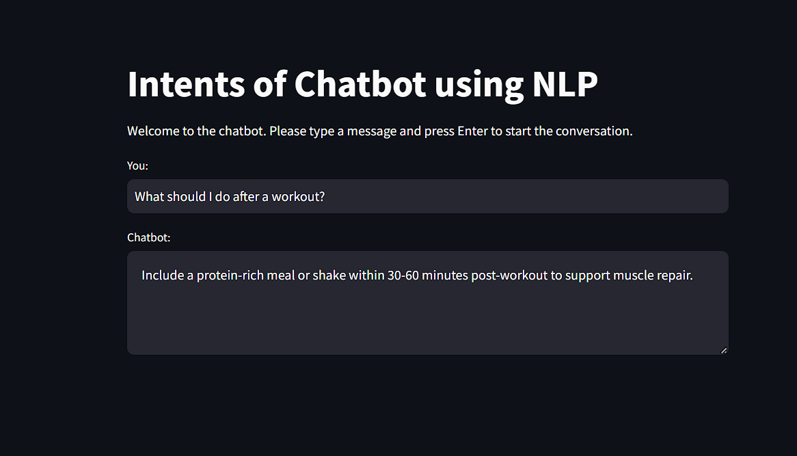
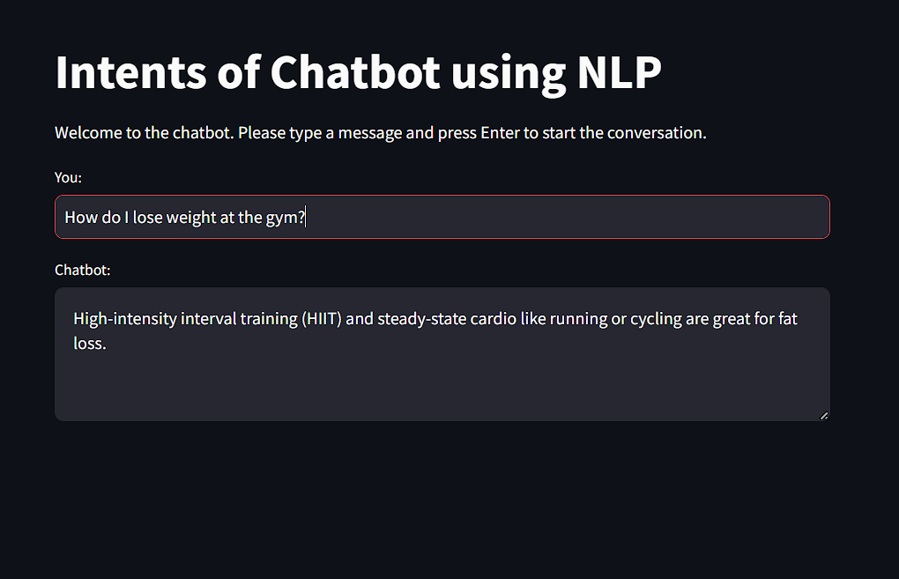

# NLP Gym Chatbot

This repository contains the code for a **Gym Chatbot** built using **Natural Language Processing (NLP)** techniques and **Logistic Regression**. The chatbot is designed to assist users with gym-related queries, including exercise recommendations, workout schedules, and dietary advice. It is implemented using Python and Streamlit for the interactive web-based interface.

## Project Overview

The Gym Chatbot uses machine learning and NLP to classify user intents and respond with relevant fitness advice. It is trained on a labeled dataset containing various intents related to gym queries such as exercises, diet, equipment usage, and general fitness knowledge. The project leverages the **TfidfVectorizer** for feature extraction and **Logistic Regression** for intent classification.

### Features:
- Provides personalized exercise and workout advice.
- Offers dietary tips and gym equipment usage information.
- Stores conversation history for future reference.
- Interactive web interface built using **Streamlit**.
- Model training and NLP pipeline for intent recognition.

## Installation

To run the Gym Chatbot locally, follow the instructions below:

### 1. Clone the Repository

```bash
git clone https://github.com/shivdattmishra/Implementation_of_Chatbot_using_NLP.git
cd gym-chatbot
```

### 2. Install Required Libraries

Ensure you have Python 3.6+ installed. Then, create a virtual environment and install the dependencies.

```bash
python -m venv venv
source venv/bin/activate  # On Windows use `venv\Scripts\activate`
pip install -r requirements.txt
```

### 3. Download the NLTK Data

Run the following code to download necessary NLTK data:

```python
import nltk
nltk.download('punkt')
```

### 4. Run the App

To launch the chatbot in your browser, run:

```bash
streamlit run app.py
```

This will open a local Streamlit app where you can interact with the chatbot.

## Project Structure

- **app.py**: Main application file that runs the Streamlit interface.
- **intents.json**: Dataset containing the intents and responses for training the chatbot.
- **chat_log.csv**: Logs the conversation history between the user and the chatbot.
- **model.py**: Contains the code to train the machine learning model (Logistic Regression).
- **requirements.txt**: Lists the required Python libraries to run the project.

## How It Works

1. **Data Preprocessing**:  
   The intents are loaded from the **intents.json** file, which includes patterns (user queries) and responses (chatbot replies). Each pattern is transformed into a feature vector using **TfidfVectorizer**.

2. **Training the Model**:  
   A **Logistic Regression** model is trained on the processed data to predict the intent based on the user’s input.

3. **Prediction & Response**:  
   The chatbot receives input from the user, transforms it using the same vectorizer, and predicts the intent. It then responds with a random selection from the appropriate responses in the **intents.json** file.

4. **Logging**:  
   Each conversation (user input and chatbot response) is logged into **chat_log.csv** for historical reference.

## Screenshots

### Chatbot Interface:

#### Result 1


#### Result 2



## Future Enhancements

- **Integration with advanced NLP models** like GPT-3 or BERT for better context understanding.
- **Voice interaction** capabilities for hands-free operation in the gym.
- **User profile** integration to personalize responses based on fitness level and goals.
- **Mobile app integration** to provide users with a native application for easy access to fitness advice.
- **Feedback Mechanism** for users to provide feedback on the chatbot's responses.
- **Advanced Intent Detection and Entity Recognition** using deep learning-based Named Entity Recognition (NER).

## Acknowledgments

- **Aditya Prashant Ardak** for mentorship and guidance throughout the project.
- **TechSaksham** for providing the internship platform and resources.
- The **Streamlit** and **Scikit-learn** libraries, which helped in building the web interface and machine learning model.

